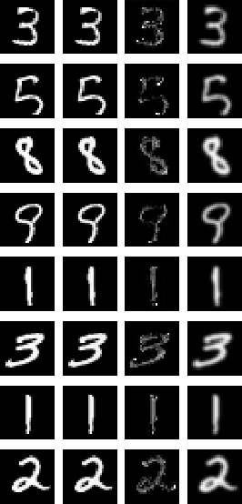

# Implementation of HiDDeN - Hiding Data in MNIST

Based on _HiDDeN: Hiding data with deep networks (Zhu et al., 2018)_

This is a preliminary implementation.

## Requirements

See requirements.txt

## Examples

Here some examples after training the model for a few epochs. From left to right: Cover Image, Encoded Image, Difference Image (magnified), Noise Image.

## Open Points

- Implement more Noise Layers (gaussian and dropout available)
- Calibrate / Weight Losses
- Inspect overfitting of discriminator
- Summary writers / Model Savings
- Cmd tool

