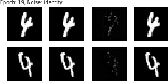
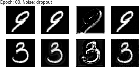

# Implementation of HiDDeN - Hiding Data in MNIST

Based on [_HiDDeN: Hiding data with deep networks (Zhu et al., 2018)_](https://arxiv.org/pdf/1807.09937)

This is a preliminary implementation. Applicable beyond MNIST data.

## Requirements

See [requirements.txt](requirements.txt)

## Examples

Samples and corresponding images after and during model training.

### Final Samples

*Figure showing results when using Gaussian blurring as noise. From left to right column: Cover Image, Encoded Image, Difference Image (magnified), Noise Image.*

### Comparison of different Noise Layers

The following figures show how encoded images / difference images change over epochs for random samples.

*Figure showing results after specific epochs when using Gaussian blurring as noise. From left to right column: Cover Image, Encoded Image, Difference Image (magnified), Noise Image.*

*Figure showing results after specific epochs when using Identity 'noise'. From left to right column: Cover Image, Encoded Image, Difference Image (magnified), Noise Image.*

*Figure showing results after specific epochs when using dropout noise. From left to right column: Cover Image, Encoded Image, Difference Image (magnified), Noise Image.*

## Open Points

- Implement more Noise Layers (gaussian, dropout and identity available)
- Calibrate / Weight Losses
- Summary writers / Model Savings
- Cmd tool
- Testing

